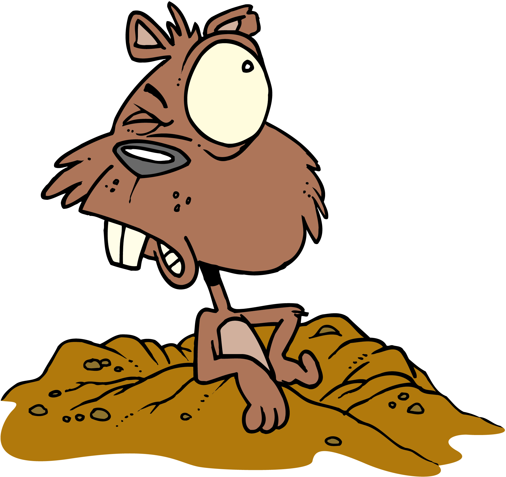

# goguette

GoGeuette is a golang code generator to produce collections-like types
for a Golang struct. This is an attempt to balance lack of generics in 
Golang 1.x

Generated code is hignly inspired by [Koltin's collections](https://kotlinlang.org/api/latest/jvm/stdlib/kotlin.collections)

## generated code

With generics support, one would define a List of Foo elements as
`List[Foo]` ... but we're stuck in Golang 1.x, so we generate code
as `ListƒFoo` instead. If you wonder, `ƒ` is Latin f with hook 
[U+0192](http://www.fileformat.info/info/unicode/char/0192/index.htm). This has been chosen as it can be read "_List oƒ Foo_".

Can type on Mac's keyboard using `Alt+F`, not sure how portable this is :P

## About the name

pronounce just like `go get`

"goguette" is a French noun used to designate both a party where the rules are not in order and where everything is allowed, and humorous words that can be perceived as being inappropriate.
